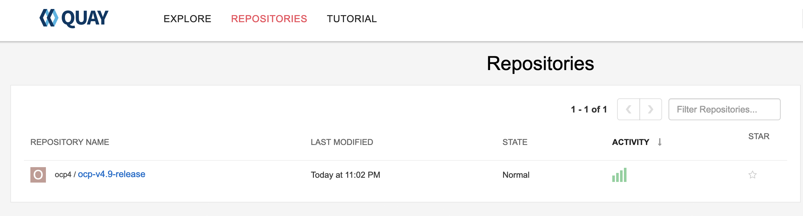
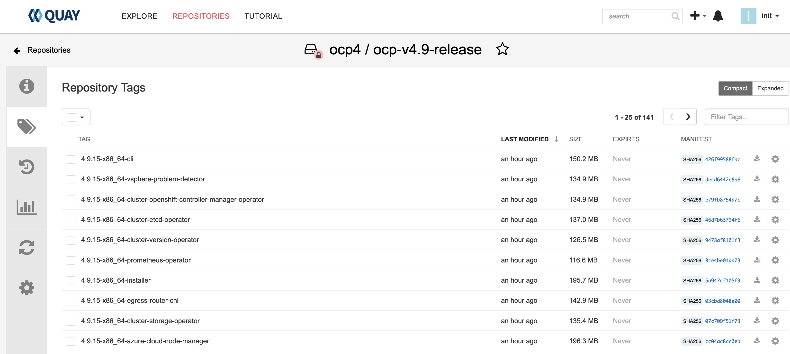

# ocp-quay-mirror
Configures a quay container repository for the purpose of installing OpenShift in restricted networks using [mirror-registry](https://github.com/quay/mirror-registry).

### Calling ocp-quay-mirror module
```terraform
module "quay" {
  source = "github.com/ekleinso/terraform-modules-ocp.git//quay?ref=1.1"

  depends_on = []

  binaries_client = "https://mirror.openshift.com/pub/openshift-v4/clients/ocp/stable-4.9/openshift-client-linux.tar.gz"
  installer = "https://github.com/quay/mirror-registry/releases/download/1.0.0-RC6/mirror-registry-online.tar.gz"
  install_dir = "/opt/podman/quay"
  password = "passw0rd"
  ocp_release = "4.9.15"
  repository = "ocp4/ocp-v4.9-release"
  pull_secret = "/tmp/pull-secret"
}
```

#### terraform variables

| Variable                         | Description                                                  | Type   | Default |
| -------------------------------- | ------------------------------------------------------------ | ------ | ------- |
| binaries_client                  | The location of the OpenShift client                         | string | https://mirror.openshift.com/pub/openshift-v4/clients/ocp/stable-4.9/openshift-client-linux.tar.gz |
| binaries_mirror     | The location of a pre-downloaded OpenShift mirror repository              | string | - |
| installer   | The location of the Quay installation                                             | string | https://github.com/quay/mirror-registry/releases/download/1.0.0-RC6/mirror-registry-online.tar.gz |
| install_dir    | Location to install Quay files and act as main container storage repository    | string | /opt/podman/quay |
| password   | Password to use for Quay init user. A random string is generated if not set        | string | - |
| ocp_release  | OpenShift release to mirror                                                      | string | 4.9.15 |
| repository | The repository to use in Quay for the OpenShift containers                         | string | ocp4/ocp-v4.9-release |
| product_repo | The OpenShift product repo to mirror                                             | string | openshift-release-dev |
| pull_secret  | The location of the pull-secret file                                             | string | - |
| architecture | The architecture of containers to mirror                                         | string | x86_64 |
| mirror_repo | Mirror the OpenShift repository                                                   | bool | true |

#### operating the terraform
This can function as a module for and end-to-end Terraform based OpenShift restricted network deployment or it can be run directly to deploy a Quay repository to mirror container images for a restricted network installation.

Sizing for **install_dir** will depend on how much you are planning to store in the repository. The OpenShift release for most 4.x versions is 7-10GB if you are planning to mirror the Operator Hub a much large amount of space is required for example the **redhat-operators** catalog is ~100GB and Cloud Pak for Integration images are ~150GB. Please note that the **install_dir** is also used as a scratch space for the installation so it would be best to start with 100GB.

The default settings will download files from the internet to support installing Quay and populating the repository. Here is a sample tfvars file for downloading.
```yaml
binaries_client="https://mirror.openshift.com/pub/openshift-v4/clients/ocp/stable-4.9/openshift-client-linux.tar.gz"
installer = "https://github.com/quay/mirror-registry/releases/download/1.0.0-RC6/mirror-registry-online.tar.gz"
install_dir = "/opt/podman/registry"
ocp_release = "4.9.15"
repository = "ocp4/ocp-v4.9-release"
product_repo = "openshift-release-dev"
pull_secret = "/root/pull-secret"
```

It is also possible to provide the installation files locally. This scenario may be required when installing without bastion access to the internet where you might provide the files on removable media. Here is a sample tfvars file using local copies.
```yaml
binaries_mirror="file:///mnt/usbdisk/ocp-mirror.tar.gz"
binaries_client="file:///mnt/usbdisk/openshift-client-linux.tar.gz"
installer = "file:///mnt/usbdisk/mirror-registry-online.tar.gz"
install_dir = "/opt/podman/registry"
ocp_release = "4.9.15"
repository = "ocp4/ocp-v4.9-release"
product_repo = "openshift-release-dev"
pull_secret = "/mnt/usbdisk/pull-secret"
```
In this configuration we added the **binaries_mirror** variable that references an archive of the OpenShift mirror. To create this archive you can run these commands from a system with internet access and copy to your removable media.
```shell
$ oc adm release mirror -a /mnt/usbdisk/pull-secret --to-dir=./mirror quay.io/openshift-release-dev/ocp-release:4.9.15-x86_64
$ tar czf ocp-mirror.tar.gz mirror
```

The Terraform will output the following information.

####additionalTrustBundle

These are the certificates generated by Quay found in **<install_dir>/runtime/quay-config**. They need to be added to the **additionalTrustBundle** section in the **install-config.yaml** to use this Quay repository.
```
additionalTrustBundle = <<EOT
-----BEGIN CERTIFICATE-----
... Quay crt
-----END CERTIFICATE-----
-----BEGIN CERTIFICATE-----
... CA crt
-----END CERTIFICATE-----
EOT
```

####imageContentSourcePolicy

To use the new mirrored repository for upgrades, use the following to create an ImageContentSourcePolicy in OpenShift.

```yaml
imageContentSourcePolicy = <<EOT
apiVersion: operator.openshift.io/v1alpha1
kind: ImageContentSourcePolicy
metadata:
  name: example
spec:
  repositoryDigestMirrors:
  - mirrors:
    - quay.example.com:8443/ocp4/ocp-v4.9-release
    source: quay.io/openshift-release-dev/ocp-release
  - mirrors:
    - quay.example.com:8443/ocp4/ocp-v4.9-release
    source: quay.io/openshift-release-dev/ocp-v4.0-art-dev
EOT
```

####imageContentSources

To use the new mirrored repository to install, add the following section to the install-config.yaml:

```yaml
imageContentSources = <<EOT
imageContentSources:
- mirrors:
  - quay.example.com:8443/ocp4/ocp-v4.9-release
  source: quay.io/openshift-release-dev/ocp-release
- mirrors:
  - quay.example.com:8443/ocp4/ocp-v4.9-release
  source: quay.io/openshift-release-dev/ocp-v4.0-art-dev
EOT
```

####Installation binaries

The OpenShift installation binaries are extracted and copied to **install_dir**.
```
openshift-baremetal-install = "/opt/podman/registry/bin/openshift-baremetal-install"
openshift-install = "/opt/podman/registry/bin/openshift-install"
```

####OpenShift pull-secret

The OpenShift pull secret is updated with the Quay repository information and also copied to **install_dir**.
```
pull-secret = {
  "auths" = {
    "quay.example.com:8443" = {
      "auth" = "aW5pdDoxMjM0NTY3ODkwYWJjZGVm"
      "email" = "init@quay.example.com"
    }
    "quay.io" = {
      "auth" = "1234567890abcdef="
      "email" = "user@example.com"
    }
    "registry.connect.redhat.com" = {
      "auth" = "1234567890abcdef="
      "email" = "user@example.com"
    }
    "registry.redhat.io" = {
      "auth" = "1234567890abcdef="
      "email" = "user@example.com"
    }
  }
}
```

####Quay installation specifics

```
quay-credentials = "(init, 1234567890abcdef)"
quay-url = "https://quay.example.com:8443"
```

When you login to the UI you can see the mirror repository that is created.

As well as the repository tags.


####Mirror other OCP releases

Here are some sample tfvars for mirroring other OpenShift releases.

**4.8**
```yaml
binaries_client="https://mirror.openshift.com/pub/openshift-v4/clients/ocp/stable-4.8/openshift-client-linux.tar.gz"
installer = "https://github.com/quay/mirror-registry/releases/download/1.0.0-RC6/mirror-registry-online.tar.gz"
install_dir = "/opt/podman/registry"
ocp_release = "4.8.27"
repository = "ocp4/ocp-v4.8-release"
product_repo = "openshift-release-dev"
pull_secret = "/root/pull-secret"
```

**4.7**
```yaml
binaries_client="https://mirror.openshift.com/pub/openshift-v4/clients/ocp/stable-4.7/openshift-client-linux.tar.gz"
installer = "https://github.com/quay/mirror-registry/releases/download/1.0.0-RC6/mirror-registry-online.tar.gz"
install_dir = "/opt/podman/registry"
ocp_release = "4.7.41"
repository = "ocp4/ocp-v4.7-release"
product_repo = "openshift-release-dev"
pull_secret = "/root/pull-secret"
```

